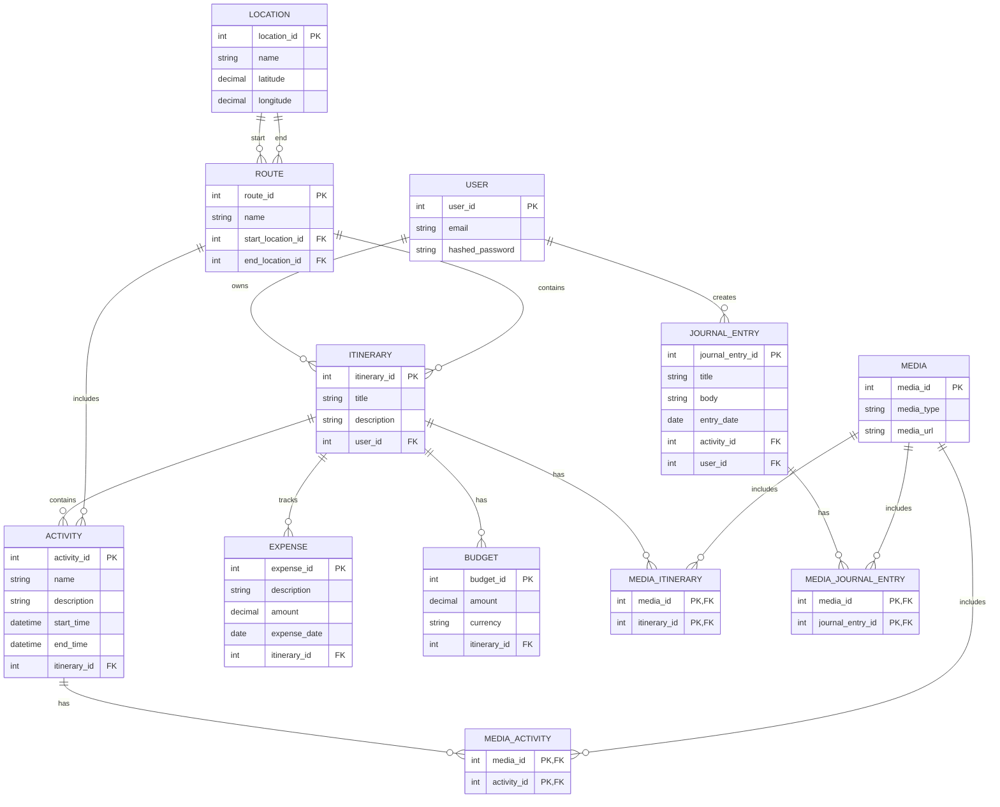

# JourniPlan

**JourniPlan** is an open-source travel planner and micro journaling app that helps you organize and document your trips in one place. 

## Features
- **Day-by-Day Itinerary Planner**: Plan your activities, destinations, and events for each day of your trip.
- **Micro Journaling**: Capture thoughts, photos, and videos as you go, with location-based check-ins and journaling prompts.
- **Maps & Directions**: Seamless integration with maps to help navigate between planned destinations.
- **Collaborative Trip Planning**: Share and collaborate on itineraries with friends or family.
- **Expense & Budget Tracking**: Monitor your spending and stay within your budget.
- **Offline Mode**: Access your plans and journals even without an internet connection.

Built using **Elixir** and **Phoenix LiveView**, JourniPlan aims to provide a seamless and interactive experience for travelers looking to plan and preserve memories of their adventures.

## ER diagram (WIP)

## Start server 

To start your Phoenix server:

  * Run `mix setup` to install and setup dependencies
  * Start Phoenix endpoint with `mix phx.server` or inside IEx with `iex -S mix phx.server`

Now you can visit [`localhost:4000`](http://localhost:4000) from your browser.

Ready to run in production? Please [check our deployment guides](https://hexdocs.pm/phoenix/deployment.html).

## Learn more

  * Official website: https://www.phoenixframework.org/
  * Guides: https://hexdocs.pm/phoenix/overview.html
  * Docs: https://hexdocs.pm/phoenix
  * Forum: https://elixirforum.com/c/phoenix-forum
  * Source: https://github.com/phoenixframework/phoenix
